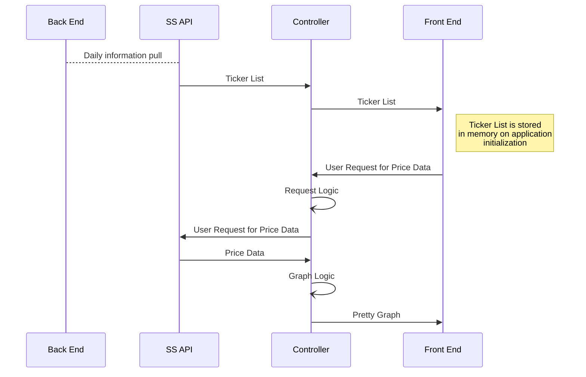
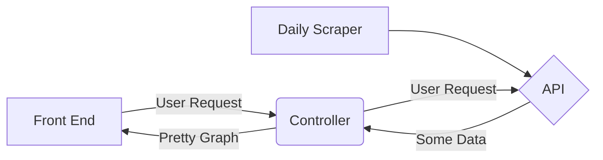

# StockSleuth

Welcome to the Stock Sleuth Angular App! We at Stock Sleuth are incredibly opinionated and never do anything wrong. That's why we chose an Angular front end framework instead of something with a cooler name. Any questions? No? Great. Let's move on.

Stock Sleuth is a web-app that allows users to view consolidated analytics and metrics based on a stock of interest. The backend is built on a custom API in Python and is hosted via a Flask app. This front end is built in Angular, primarily, which utilizes a combination of TypeScript, JavaScript, Plotly, and NodeJS. The front end was built on a diet of caffeine - specifically in the form of Lo-Carb Monster energy drinks - and sadness. Eventually user authentication will be done via Firebase.

This specific component of Stock Sleuth handles the front end of the client.


## Getting Started

These instructions will get you a copy of the project up and running on your local machine for development and testing purposes.

### Requirements

In order to use the Stock Sleuth NodeJS app you will need to first install NodeJS. Angular Dependency packages can be found in the [packages.json](https://github.com/Stock-Sleuth/stock_sleuth_node/blob/master/package.json) file.

Notable additions to the default Angular packages include:
* Angular Materials
* Bootstrap
* Plotly
* Python
* RxJS
* FontAwesome

You will also need the [Stock Sleuth Flask](https://github.com/Stock-Sleuth/stock_sleuth_flask) app running for API data.

## Starting the app

Clone the project, open a bash terminal, CD into the project directory and run the Angular app locally with:
```
ng serve
```
This will run the Angular application at http://localhost:4200/

You will also need an instantiation of the Flask app running locally. To do this, clone the Stock Sleuth Flask app project, open a bash terminal, CD into the project directory and run the following command:
```
py wsgi.py 
```

## Data Flow Theory

SS Data Sequencing Chart:


Simple User Request Flow Chart:


